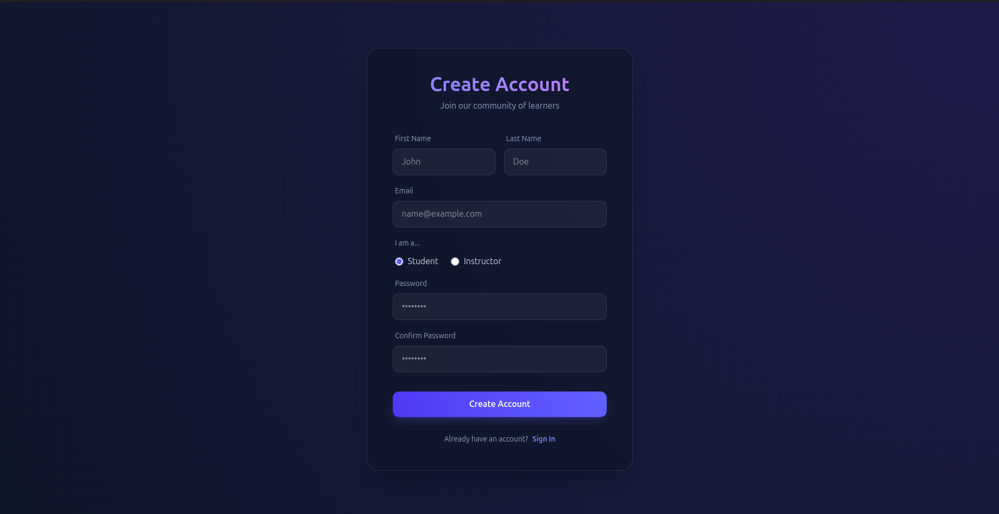
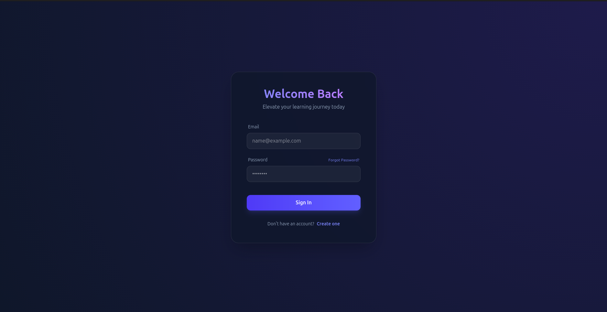
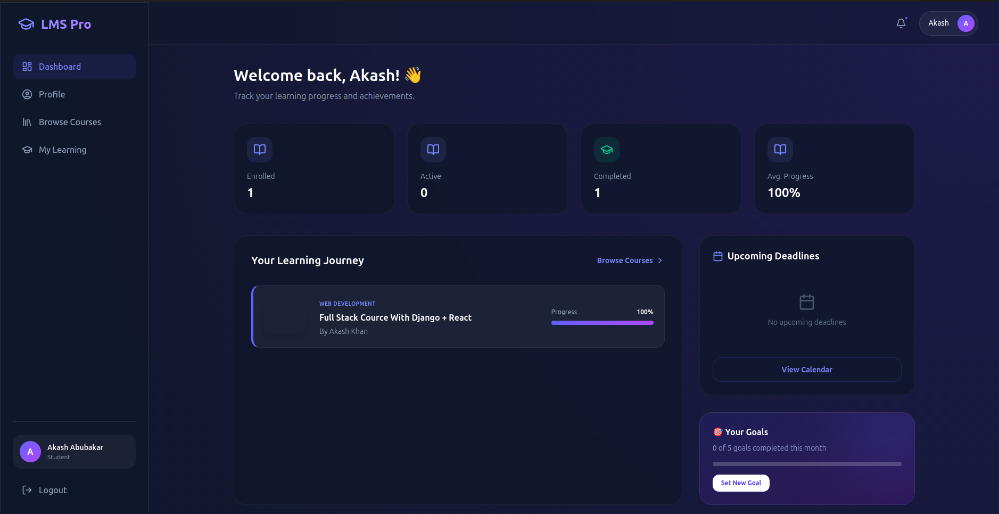
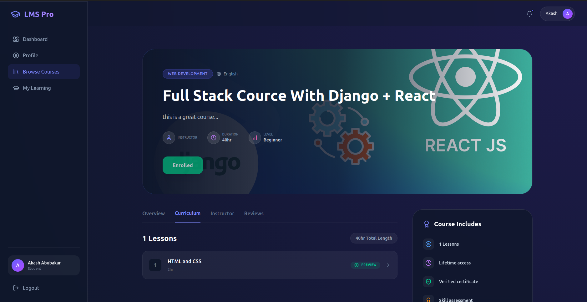
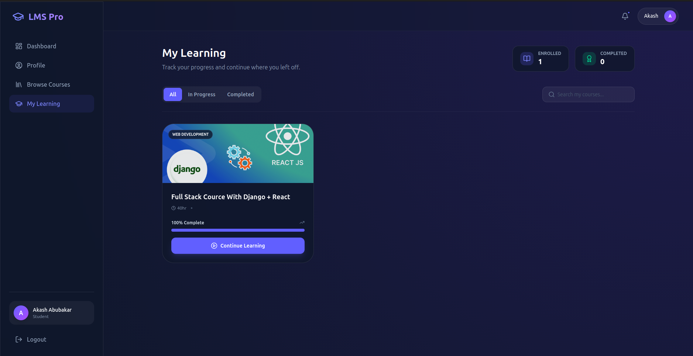

# Learning Management System (LMS)

Full-stack LMS built with Django REST Framework (backend) and React + Vite (frontend).

## Project layout

- `client/lms/` — React frontend (Vite) with components, pages, and API helpers.
- `server/lms/` — Django backend (Django REST Framework) with apps: `courses`, `users`, `enrollments`, `dashboard`, etc.

## Quick start

Prerequisites:

- Python 3.9+
- Node.js 16+
- pip, npm

Backend (development):

```bash
cd server/lms
python3 -m venv venv
source venv/bin/activate
pip install -r requirements.txt
python manage.py migrate
python manage.py createsuperuser
python manage.py runserver
```

Frontend (development):

```bash
cd client/lms
npm install
# set VITE_API_BASE_URL in .env to http://localhost:8000/api
npm run dev
```

API base: `http://localhost:8000/api`


## 📸 Screenshots

### Register Page

*Create a new account with role selection*

### Login Page

*User authentication with email and password*

### Dashboard

*Admin dashboard showing statistics and reports*

### Course Listing

*Browse and search available courses*

### Course Details

*Detailed view of a course with enrollment option*

### Learning Interface

*Interactive learning environment for enrolled students*

## Important files

- Frontend entry: [client/lms/src/main.jsx](client/lms/src/main.jsx)
- Frontend auth/context: [client/lms/src/context/AuthContext.jsx](client/lms/src/context/AuthContext.jsx)
- Backend settings: [server/lms/lms/settings.py](server/lms/lms/settings.py)

## Tests

- Backend tests: `cd server/lms && python manage.py test`
- Frontend tests (if present): `cd client/lms && npm run test`

## Contributing

Create a branch, make changes, add tests, run migrations for model changes, and open a PR.

---
